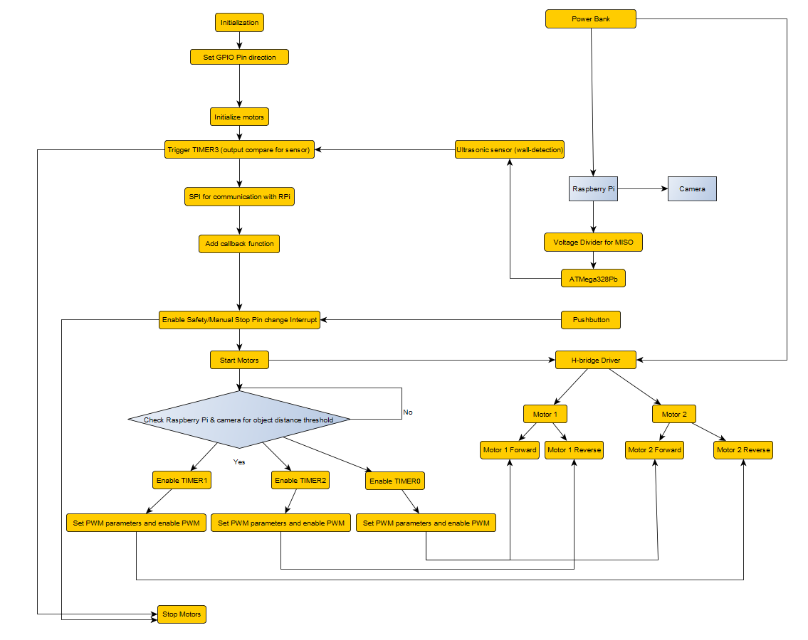
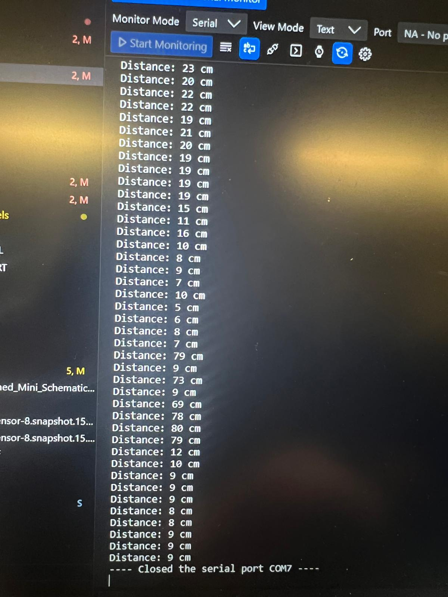
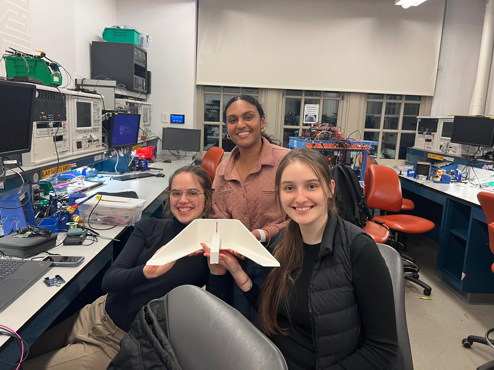
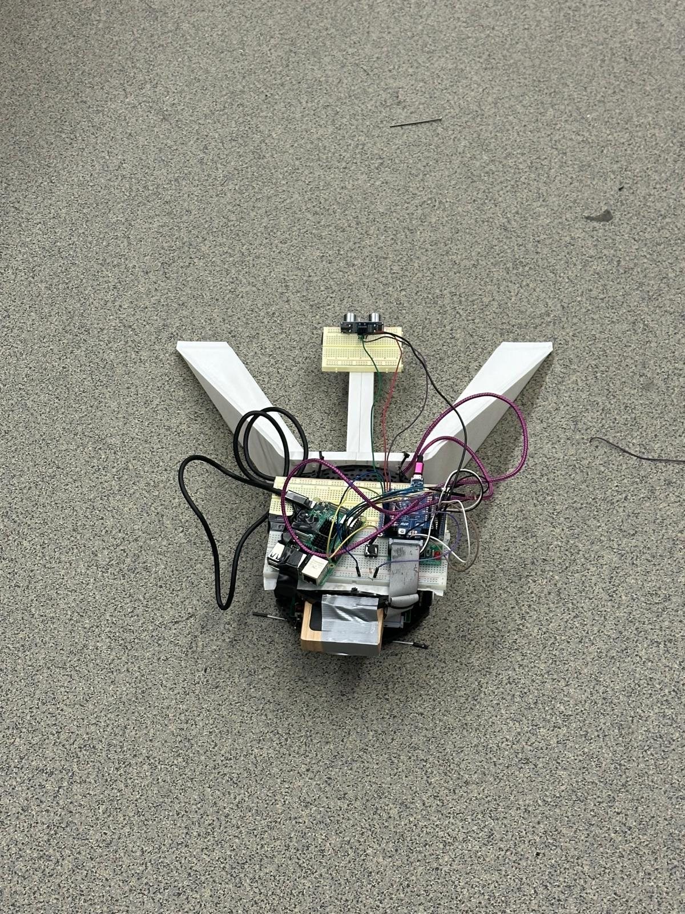
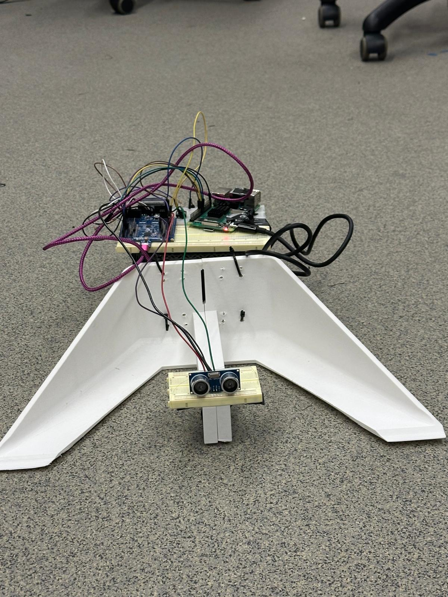

   

# final-project-skeleton

* Team Number: 1
* Team Name: CAT
* Team Members: Chekayli Meyer, Andrea González, Taarana Jammula
* GitHub Repository URL: [upenn-embedded/final-project-s25-cat: ese3500s25-final-project-s25-final-project-skeleton created by GitHub Classroom](https://github.com/upenn-embedded/final-project-s25-cat)
* GitHub Pages Website URL: [for final submission]

## Final Project Proposal

### 1. Abstract

*In a few sentences, describe your final project.*

Our final project involves developing an autonomous trash collection vehicle that detects, collects, and stores small lightweight objects while navigating its environment. The robot moves forward until an object is detected within a few centimeters, at which point it stops, collects using a shovel-like part, and pushes it against a wall. The system would use an IR sensor for object detection and an ultrasonic sensor for wall detection.

### 2. Motivation

*What is the problem that you are trying to solve? Why is this project interesting? What is the intended purpose?*

We want to address the growing need for small-scale automated cleanup solutions in both indoor and outdoor environments. We are particularly interested in applying embedded systems and robotics principles to create a functional and modular trash-collection vehicle. This project will allow us to integrate course topics such as sensors, actuator control, serial communication, and embedded C programming in a hands-on and practical setting. Beyond the course requirements, we aim to continue building the system with real-time object recognition and autonomous navigation to explore more advanced robotics applications.

### 3. System Block Diagram

*Show your high level design, as done in WS1 and WS2. What are the critical components in your system? How do they communicate (I2C?, interrupts, ADC, etc.)? What power regulation do you need?*

The critical components of our system are the battery, buck converter, ultrasonic sensor, IR sensor, Raspberry Pi, camera, the ATMega328Pb, the L298N H-Bridge Driver, and 2 motors. The camera will be connected to the raspberry pi and will send information to the ATMega328Pb via I2C (serial communication). Timer0 will use output compare to detect walls, and Timer1 and Timer2 will be connected to separate motors once an object is detected (to push the object to the beacon). Interrupts INT0 and INT1 are used for IR sensor detection for the object. We also added a manual stop interrupt for safety. We have a buck converter from the 6V alkaline battery for power management to the raspberry pi. We also have a logic level shifter between the Raspberry Pi (3.3V) and ATMega328Pb (5V).

### 4. Design Sketches

*What will your project look like? Do you have any critical design features? Will you need any special manufacturing techniques to achieve your vision, like power tools, laser cutting, or 3D printing?*

We are lasercutting the base of the robot car and are purchasing the wheels and other required sensors. The critical design features like motors, a MCU stand, the battery, breadboard, IR sensor, ultrasonic sensor, camera, and shovel are included in the sketch above.

### 5. Software Requirements Specification (SRS)

*Formulate key software requirements here. Think deeply on the design: What must your device do? How will you measure this during validation testing? Create 4 to 8 critical system requirements.*

**5.1 Definitions, Abbreviations**

**ATmega328PB:** Microchip ATmega328PB microcontroller which is an 8-bit AVR MCU

**IR:** Infrared which is the proximity or reflectance sensor

**US:** Ultrasonic Sensor which will be used for distance measurement like in Lab 3

**PWM:** Pulse Width Modulation for motor speed control

**ADC:** Analog-to-Digital Converter

**I2C:** Inter-Integrated Circuit for two-wire serial communication protocol

**GPIO:** General Purpose Input/Output

**5.2 Functionality**

| **Req ID** | **Software Requirement**                                                                                                                                                                                                                                                                                                                                                                                                                                                                                                                                                   | **Verification Method**                                                                                                                                                                                                                                                                                                                                                                                                                                                                                                                    |
| ---------------- | -------------------------------------------------------------------------------------------------------------------------------------------------------------------------------------------------------------------------------------------------------------------------------------------------------------------------------------------------------------------------------------------------------------------------------------------------------------------------------------------------------------------------------------------------------------------------------- | ------------------------------------------------------------------------------------------------------------------------------------------------------------------------------------------------------------------------------------------------------------------------------------------------------------------------------------------------------------------------------------------------------------------------------------------------------------------------------------------------------------------------------------------------ |
| **SRS-01** | Sensor Polling Frequency: The firmware will poll the IR sensor and ultrasonic sensor at least 10 times per second (≥10 Hz each) to ensure timely detection of trash and obstacles.                                                                                                                                                                                                                                                                                                                                                                                              | Test: Use a logic analyzer or oscilloscope to verify sensor read operations (or an LED toggled in code on each read) occur at ≥10 Hz. Confirm that both IR and US sensor readings are updated at 100 ms intervals or faster under normal operation.                                                                                                                                                                                                                                                                                             |
| **SRS-02** | Trash Detection Threshold: The system will detect a piece of trash when the IR sensor’s reading exceeds a calibrated threshold value. Upon threshold crossing, the microcontroller shall initiate the trash collection routine (e.g. stop forward motion and activate the scoop) within 100 ms.                                                                                                                                                                                                                                                                                 | Test: Place a standard test object (simulated trash) at the detection range limit (e.g. ~15 cm in front of the IR sensor) and verify that the firmware recognizes it (IR reading above threshold) and triggers the scoop mechanism within 0.1 s. Repeat across several distances and object sizes to confirm reliable threshold detection.                                                                                                                                                                                                       |
| **SRS-03** | Obstacle Avoidance Threshold: The firmware will use the ultrasonic sensor to detect walls or obstacles within a set distance (e.g. 30 cm). If an obstacle is closer than the threshold, the system shall halt or turn away within 100 ms to avoid collision.                                                                                                                                                                                                                                                                                                                     | Test: Gradually bring a wall or large object toward the robot and confirm that when it crosses the ~30 cm range, the robot’s motors stop or turn immediately (within 0.1 s). Use a measuring tape to ensure the trigger distance is ~30 cm and a timer or high-speed camera to measure response time from detection to motor stop.                                                                                                                                                                                                              |
| **SRS-04** | Image Processing: The Raspberry Pi will capture images using an attached camera at a rate of at least 1 frame per second while scanning for trash or the beacon. It shall process the image and send detection results to the ATmega328PB via I2C within 500 ms.                                                                                                                                                                                                                                                                                                                 | Test: Place a target object (trash or beacon) in front of the camera. Verify that the Pi detects it and sends a message to the MCU in under 0.5 seconds. Check Pi logs and I2C communication timing.                                                                                                                                                                                                                                                                                                                                             |
| **SRS-05** | PWM Motor Control Timing: The firmware will drive the motors using a PWM signal of at least 100 Hz frequency (with a target around 500 Hz for smooth control).The duty cycle shall be updated as needed (on speed changes) with a control loop period not greater than 100 ms. This ensures smooth speed variation without perceptible stalling or jitter.                                                                                                                                                                                                                       | Test: Measure the PWM output on the motor driver input using an oscilloscope. Verify the frequency is ≥100 Hz (e.g. ~500 Hz achieved, within ±5% of target). Change speed commands and confirm the duty cycle adjusts within the next 100 ms cycle. No audible irregularities or excessive motor vibration should be observed at the set frequency (confirm by listening and motor behavior).                                                                                                                                                  |
| **SRS-06** | I2C Communication Protocol: The microcontroller will communicate with the Raspberry Pi using the I2C bus operating at standard speed (100 kHz clock). Sensor status updates (e.g. trash detected, weight, obstacle distance) shall be transmitted to the Pi at least 2 times per second, and command/control data from the Pi (e.g. navigation commands) shall be processed within 100 ms of receipt. The I2C communication shall include error-checking (ACK/NACK monitoring); on a communication failure, the system shall retry the transmission at least once within 50 ms. | Test: Use a protocol analyzer or logic analyzer on the I2C lines (with level shifting in place) to verify the bus clock is ~100 kHz. Run the system and confirm via logs that sensor data messages are sent to the Pi ≥2 Hz. Introduce a forced NACK or bus error (e.g. by briefly disconnecting SDA) and ensure the firmware attempts a retry and recovers communication. All commands from the Pi (simulated via I2C commands) should be observed to take effect on the robot (e.g. a movement command causes motor PWM change) within 0.1 s. |
| **SRS-07** | User Interrupt & Safety Response: The system will provide a user interrupt (e.g. an emergency stop button or remote kill switch input to a GPIO interrupt). When the user interrupt is activated, the firmware shall immediately override normal operation and stop all motor activity within 100 ms, entering a safe idle state. Normal operation can only resume after a manual reset or explicit resume command.                                                                                                                                                             | Test: While the robot is moving, activate the emergency stop (press the button or trigger the interrupt line). Measure the time for the motors to stop (e.g. using timestamps or an LED triggered at stop); it should be <100 ms. Verify that during the stop condition, no motor motion occurs and the robot remains stationary. Attempt to issue movement commands during the stop state to ensure they are ignored. Finally, reset the interrupt and confirm the system only resumes operation when allowed.                                  |

### 6. Hardware Requirements Specification (HRS)

*Formulate key hardware requirements here. Think deeply on the design: What must your device do? How will you measure this during validation testing? Create 4 to 8 critical system requirements.*

*These must be testable! See the Final Project Manual Appendix for details. Refer to the table below; replace these examples with your own.*

**6.1 Definitions, Abbreviations**

**H-Bridge** An electronic circuit (L298N module) that drives the motors in both directions

**Beacon:** Beacon used as a drop-off location marker

**Battery:** On-board power source (rechargeable) for motors and electronics

**6.2 Functionality**

| **Req ID** | **Hardware Requirement**                                                                                                                                                                                                                                                                                                                                                                                                                                                                                                                                            | **Verification Method**                                                                                                                                                                                                                                                                                                                                                                                                                                                                                                                                                                                                                                                 |
| ---------------- | ------------------------------------------------------------------------------------------------------------------------------------------------------------------------------------------------------------------------------------------------------------------------------------------------------------------------------------------------------------------------------------------------------------------------------------------------------------------------------------------------------------------------------------------------------------------------- | ----------------------------------------------------------------------------------------------------------------------------------------------------------------------------------------------------------------------------------------------------------------------------------------------------------------------------------------------------------------------------------------------------------------------------------------------------------------------------------------------------------------------------------------------------------------------------------------------------------------------------------------------------------------------------- |
| **HRS-01** | Drive Motor Performance:The motor and drive system will propel the robot at a forward speed of≥0.3 m/son level ground while carrying a full load of collected trash (at least 2 kg). Each motor (with L298N driver) must provide sufficient torque to start moving from standstill with the full load and climb a mild incline of 5°.                                                                                                                                                                                                                                   | Test: Load the robot with a dummy weight of 2 kg (to simulate trash). Mark a 1 m distance on flat floor and time the robot driving that distance; it should arrive in ≤3.3 s (0.3 m/s or faster). Verify the robot can also ascend a 5° ramp from standstill with the same load without stalling. Monitor motor current draw with an ammeter during these tests to ensure it stays within L298N and motor limits (no overheating or current limiting observed).                                                                                                                                                                                                            |
| **HRS-02** | Infrared (IR) Sensor Range & Accuracy: The IR sensor will reliably detect a typical piece of trash (minimum size ~5 cm) at a distance of≥15 cm in front of the robot. Detection reliability at that range should be at least 90% (minimal missed detections under proper conditions). Beyond 15 cm, the sensor should not trigger on the test object, to avoid false positives outside the intended range.                                                                                                                                                              | Test: Place a standard test object (e.g. a 5 cm cube or bottle) at 15 cm from the IR sensor and observe the sensor output over 10 trials (approaching and leaving). It should correctly indicate “object present” in at least 9 out of 10 trials at 15 cm. Repeat at slightly greater distances (20 cm, 30 cm) to ensure the sensor does not indicate detection beyond ~15 cm. Also test against different materials/backgrounds to confirm consistent performance and that environmental IR (lighting) does not cause false detection.                                                                                                                                     |
| **HRS-03** | Ultrasonic Sensor Distance & Accuracy:The ultrasonic sensor will measure distances to obstacles in the range of 5 cm up to 300 cm. Within 100 cm, the distance measurement error should not exceed±1 cm , and for longer ranges (up to 300 cm) error should be within ±5 cm . (The sensor’s capability is 2–400 cm with ~0.3 cm precision in ideal conditions) This accuracy is required for reliable wall detection and navigation.                                                                                                                                 | Test: Place a flat obstacle (e.g. a wall or board) at known distances of 10 cm, 50 cm, 100 cm, 200 cm, and 300 cm from the ultrasonic sensor. For each distance, take multiple readings (e.g. 10 samples) and record the measured distances. Calculate the error compared to the true distance – it should be within ±1 cm for ≤100 cm ranges and ±5 cm for the farthest distances. Also verify the sensor consistently detects an object at 300 cm (does not miss it) and that it reports out-of-range when no object is within ~3 m.                                                                                                                                   |
| **HRS-04** | Camera Setup: The forward-facing camera Raspberry Pi Cam V3 will capture images at a resolution of at least 480p and a frame rate of 1 FPS or higher. The camera must be mounted securely and powered from the Raspberry Pi.                                                                                                                                                                                                                                                                                                                                              | Test: Power up the system and verify live image capture at 480p or higher. Confirm the camera stays in place during robot movement and reliably delivers frames to the Pi board for processing.}                                                                                                                                                                                                                                                                                                                                                                                                                                                                              |
| **HRS-05** | Battery and Power System:The robot will be powered by a battery system that provides sufficient voltage and capacity for both motors and electronics. The battery pack (and regulators) must supply12 V(nominal) for the motors and a regulated5 V±5%for the microcontroller and sensors. The capacity shall support at least1 hourof continuous operation (motors driving and sensors active) before recharge. The 5 V regulator should handle peak current draw (motor drivers + logic, ~2–3 A transient) without the voltage dropping out of the 4.75–5.25 V range. | Test: Use a multimeter to verify the battery voltage and regulator outputs. Under no-load, confirm ~12 V from the battery and 5 V at the logic rail. Then run the robot under a heavy load scenario (e.g. motors stalled or frequent start-stop to draw peak current) and measure the 5 V line stays within 4.75–5.25 V. Check that the system runs for at least 60 minutes on a full charge by driving it continuously in an obstacle course; record the run time until the battery depletes to cutoff. Also observe that the microcontroller and sensors operate normally throughout, indicating the regulator is supplying stable power (no resets or brown-outs).        |
| **HRS-06** | Logic Level Interface (I2C Bus Hardware): The I2C level shifter and bus wiring will allow reliable communication between the 5 V ATmega328PB and 3.3 V Raspberry Pi. The hardware must not introduce signal distortion at the standard 100 kHz I2C clock. Pull-up resistors or the level shifter module shall maintain the I2C lines within proper voltage thresholds for both devices. Communication integrity shall be ≥99% (no more than 1% packet loss or corruption during normal operations of 10 minutes).                                                       | Test: Instrument the SDA and SCL lines with an oscilloscope while the microcontroller and Pi exchange data. Verify the logic high level on the bus is ~3.3 V (through the level shifter) and rise/fall times are within I2C specifications at 100 kHz. Run a continuous I2C communication test for 10 minutes (transferring hundreds of messages) and count any errors or checksum failures in the data; the error rate should be <1%. Also test the bus in both idle and motor-active scenarios (to ensure motor electrical noise doesn’t disturb signals), checking that communication remains stable (use an EMI filter or shielding if needed to meet this requirement). |

### g7. Bill of Materials (BOM)

*What major components do you need and why? Try to be as specific as possible. Your Hardware & Software Requirements Specifications should inform your component choices.*

*In addition to this written response, copy the Final Project BOM Google Sheet and fill it out with your critical components (think: processors, sensors, actuators). Include the link to your BOM in this section.*

[Link to our BOM](https://docs.google.com/spreadsheets/d/11ymjW0_Uoc0fHEQ4GR5q43txAdh5dIRnGoK7Q-v5SPE/edit?usp=sharing)

ATMega 328PB

This will be our main microntroller that will control the motors and interface between the sensors in real time, and actuate the motors.

Ultrasonic sensor

The ultrasonic sensor will be positioned on top of the vehicle to detect the distance to the nearest wall or large obstacle. This way, we can avoid collisions.

Logic level shifter

Since the digital high of the ATMega328pb and the raspberry pi are different (5 V vs 3.3 V), and we want to communicate through serial, we require a logic level shifter between them. We have chosen a bidirectional logic shifter from adafruit since it will ensure we are able to communicate using I2C.

Infrarred sensor

We have chosen an analog infrarred sensor, since it is more precise than the ultrasonic sensor and it has a longer range than digital infrarred sensors. It will be placed at floor level, facing forward, to detect the "trash" that the vehicle should collect.

Buck converter

We have chosen a buck converter to 5 V because the raspberry pi and ATMega both require a stable 5V input voltage, and the 1.5 V batteries in series can have a voltage of up to 6V. When the batteries can no longer provide a voltage above 5 V, they will be switched for fresh batteries.

Raspberry Pi

The raspberry pi will be used for image processing, and will then send the navigation commands to the ATMega. We will be using this board instead of the ATMega because image processing is very computationally intensive, and we believe that using the ATMega would greatly limit the real-time performance of the system.

Camera

We will use the Raspberry Pi cam v3 because it can interface with the raspberry pi directly. This way, the raspberry pi can do the necessary image processing directly.

Car chassis

To build this, we will design a base board, laser cut it with1/8 inch acrylic and attach the motors on the bottom and the main components.

Wheels

There will be two front wheels, each attached to a motor, and one swivel support wheel in the back. This setup will ensure the vehicle wis stable and had full freedom of movement.

Motor

We have chosen dc gearbox motors motor because we believe they will provide the necessary torque to move the . We will have two motors, one for each of the front wheels that we will be able to actuate independently to steer the car.

Motor driver

The chosen motor driver is able to drive 2 DC motors, at a maximum current of 600 mA per channel. It is compatible with 5 V logic, so I can use the ATMega to control it with PWM output.

Batteries

We have decided to use alkaline AA batteries. This was a decision that balances portability, limitations on lithium-based batteries and weight considerations.

We plan to use 12 batteries in a 4x3 arrangement (4 in series to reach 6V and 3 in parallel). This decision was made to achieve both the voltage and maximum current output required. We have also included battery holders to be able to safely place all the batteries.

### 8. Final Demo Goals

*How will you demonstrate your device on demo day? Will it be strapped to a person, mounted on a bicycle, require outdoor space? Think of any physical, temporal, and other constraints that could affect your planning.*

We will require enough floor space to demonstrate the vehicle moving. We will also require small objects that the system can detect and dispose of.

### 9. Sprint Planning

*You've got limited time to get this project done! How will you plan your sprint milestones? How will you distribute the work within your team? Review the schedule in the final project manual for exact dates.*

| Milestone  | Functionality Achieved                                                                                                                  | Distribution of Work                  |
| ---------- | --------------------------------------------------------------------------------------------------------------------------------------- | ------------------------------------- |
| Sprint #1  | We want to finish the lasercutting, attachment, and wiring of the base robot and its connected hardware components.                     | We will work on this together equally |
| Sprint #2  | We want the robot to be able to move and sense and communicate distances.                                                               | We will work on this together equally |
| MVP Demo   | We want to be able to perform image processing for trash detection, and correspondingly move the robot to it.                           | We will work on this together equally |
| Final Demo | We want the robot to have full functionality on sensing and collecting the trash and correspondly moving it to the beacon autonomously. | We will work on this together equally |

**This is the end of the Project Proposal section. The remaining sections will be filled out based on the milestone schedule.**

## Sprint Review #1

### Last week's progress

We gathered most of our materials, including the base robot car, the camera, raspberry pi kit, the NiMH batteries, and the ultrasonic sensor.

We will be using the blue ultrasonic sensor (takes 5V), which we have experienced with the Theremin lab to have a greater range than the green ultrasonic sensor.

Base robot car:

Raspberry Pi Kit:

Batteries & Battery Holder:

For the battery holders, we have sent 2 to print to addlab, to test that they will fit correctly before printing all 8. We are waiting to hear back. This was sent on Monday, so we will consider alternative methods and places to 3D print our components.

For the raspberry pi, we downloaded the RPi OS and made sure to be able to connect the camera. We were able to run a simple opencv script that took a photo with the camera. We have also created a new repository for the raspberry pi code and added it as a submodule to the main project repository. This will allow us to make changes to the code on our own devices, and pull only the relevant changes directly to the Raspberry Pi.

Raspberry Pi setup to computer:

Camera connection:

Raspberry Pi Github Creation:

Addlab Print request for battery holder:

Parts order (IR sensor & Buck Converter):

Shovel design planning:

### Current state of project

* What state is the project in right now?

The project has a great foundational base as we have almost all our hardware components together. We have wired and incorporated the components that we do have. We have begun working on the link between hardware and software through testing with the raspberry pi.

* How the tasks fit into your end goal

We will need all these components to make a functional autonomous trash collection bot. Thus, by acquiring all our parts now, we are able to focus on the wiring connections and the embedded systems part. We also have tested that our raspberry pi is working as expected, which will be fundamental to our image processing.

* Hardware status - have you purchased everything you need (plus backups)? Is everything working right?

We have purchased what we need. We tested out camera and raspberry pi kit, and both work as intended.

### Next week's plan

**Planning**

**Task 1: CADing the shovel then sending to 3D print**

Estimated time: 3 hours + whatever time addlab takes to print (few days)

Assigned team members: Chekayli and Taarana

Definition of done: when it is properly attached to the base robot car

**Task 2: Ensuring the robot can move forward and backward - motor output**

Estimated time: 1 hour

Assigned team members: All

Definition of done: once the robot can move when supplied with power

**Task 3: Start writing firmware for ATMega - sensor input**

Estimated time: 6 hours

Assigned team members: All

Definition of done: once we can serial output actual distance values for the sensors

---

**Future Planning (For preparation of MVP demo and final demo):**

**Task 4: Power routing**

Estimated time: 4 hours

Assigned team members: all

Definition of done: motor and components are powered by the batteries. Dependent on addlab printing time for the battery holders and part arrival time

**Task 5: Interface RPi and ATMega using I2C**

Estimated time: 3-4 hours

Assigned: all

Definition of done: ATMega sends sensor input to RPi, RPi can respond with movement directives.

**Task 6: Object detection using OpenCV**

Estimated time: 6 hours

Assigned: all

Definition of done: we can detect objects to collect successfully from the live video input.

**Task 7: Actually figure out directives for robot movement**

Estimated time: 15 hours

Assigned: all

Definition of done: when the movement of the robot matches the object detection output.

## Sprint Review #2

### Last week's progress

We designed the shovel and an attachment block piece in SolidWorks and sent the parts to print. We designed the shovel piece so that the bottom plate is cut-out, so we can effectively trap and push trash towards the wall. We designed an extruding piece in the center of the cutout, so that we can place the IR sensor or camera to detect objects to pick up. We also created  a slot in the back-plate of the shovel, so we can adjust the height placement of the shovel when attaching it. We split the shovel into 2 halves to fit printing size requirements, and will glue the halves together once they arrive. We are waiting for the main shovel piece to arrive. We designed a block that will fit under the top plate of the base robot car, with a 3mm hole for a screw, that will fit into the slot on the back plate of the shovel (for height adjustment and attachment). We also got the battery holders that fit properly together, printed.

We gathered schematics and documentation relating to the base robot car (KatzBot), and tested the motor control with code, as well as speed and rotation with PWM (higher PWM means greater speeds, also note that there is a minimum PWM of ~100 for the motor to move). We got the car’s wheels to turn forward and backwards separately and simultaneously at different speeds, and the overall car to rotate clockwise.

We expanded upon our code from Part C of the Theremin Lab (Lab 3) and used the HC-SR04P blue ultrasonic sensor (takes 5V), to have a greater distance range than the green ultrasonic sensor. Right now, we have working code that moves the robot towards an object. We were able to serial output distance values for the sensor. Then, we programmed the robot to stop if the ultrasonic sensor reads a smaller distance than our set distance threshold which is adjustable. The robot successfully performs this action. We intend to further test what this threshold will be after implementing the raspberry pi with our robot.

We decided to change our serial protocol from I2C to SPI because we thought we would be able to take advantage of the full-duplex capabilities of the protocol. We are setting the Atmega to be the peripheral and the raspberry pi to be the controller, and we wrote the code to receive SPI commands , and send back either status codes or ultrasonic sensor readings.

We restructured our existing Atmega code to modularize it, since it was all condensed into one file before and it was becoming hard to interpret and find exactly where to change different things.

We wrote the preliminary code for the Raspberry Pi interfacing. Right now, the code handles SPI communication, camera input and object detection*. Next steps involve testing the code.

* everything that would go around the model actually detecting the object.

We also updated the bash script to be able to run the code with SPI, and added more error handling into the setup of the running program.

**Proof:**

Shovel:

Printing request:

Attachment block for shovel:

Motor control videos:
https://drive.google.com/file/d/1o-LlPXBNlsq7b0NR9ot6adOTAn2zIAc2/view?usp=sharing

https://drive.google.com/file/d/1erBPFCrLf8zJfBMNw_j0bJg6JB4yxkOM/view?usp=sharing

GitHub Commits:

Motor Control:

* https://github.com/upenn-embedded/final-project-s25-cat/blob/main/motor_control.c
* https://github.com/upenn-embedded/final-project-s25-cat/blob/main/ultrasonic.c
* (Datasheet): https://github.com/upenn-embedded/final-project-s25-cat/blob/main/datasheets_and_models/Romi%20Mainboard.PDF

SPI:
https://github.com/upenn-embedded/final-project-s25-cat/blob/main/code/spi.c

https://github.com/upenn-embedded/final-project-s25-cat/blob/main/code/spi.h

Raspberry Pi:

https://github.com/andrgv/taaranator_rpi/tree/f2531cf05abb43c9d4bac655ac3ee0facf48a018

### Current state of project

* What state is the project in right now?

The ultrasonic sensor and motor control of the robot have been thoroughly tested and are working effectively: The robot stops before a collision by tracking if the object in front of it is at a smaller distance than its distance threshold we set. We are working on SPI serial communication with the Raspberry Pi and camera. We are aiming to use image processing to detect trash - we have the IR sensor part in case we would like to incorporate that.

* How the tasks fit into your end goal

From our most recent progress, connecting the hardware and writing the code for the ultrasonic sensor and writing the ATMega code for the motor control allows us to move the robot car towards the wall and stop before collision. For the image processing component, we are leveraging the Raspberry Pi and Camera and are figuring out SPI to detect what is trash and what is not. This is to differentiate between whether we should “collide” into the object in question or stop (indicating a wall nearby).

* Hardware status - have you purchased everything you need (plus backups)? Is everything working right?

We have purchased what we need. We tested our camera, raspberry pi kit, base robot car, and ultrasonic sensor, and everything works as intended.

### Next week's plan

**Reflection on Last Week’s Planning:**

For Task 1 (CADing the shovel then sending to 3D print), we estimated 3 hours; however, this took around 7-8 hours given that we further familiarized ourselves with Solidworks for the applications we were aiming to implement. Also, Addlab asked us to resize components a few times before printing given that they first said we could have a 16x10x10in build size; however, later asked us to do 10x10x10in, hence we had to pivot our dimensions to account for this.

For Task 2 (Ensuring the robot can move forward and backward - motor output), we estimated 1 hour; however, due to the complexity of our robot and its datasheets, we took 4 hours to implement the motor control (moving wheels in different directions and speeds) with the hardware and software in a cohesive manner.

For Task 3 (Start writing firmware for ATMega - sensor input), we estimated 6 hours; however, this task only took us 3 hours to implement such that the robot stopped once the ultrasonic sensor read a small distance in front of it - smaller than that of our set distance threshold. We were able to serial output actual distance values for the sensors, using base code from the Theremin lab.

**Future Planning:**

*Task 4: Power routing*

Estimated time: 4 hours

Assigned team members: Andrea (soldering), All (connection to robot car)

Definition of done: soldering wires out of the battery holders and connecting the batteries to the robot car

*Task 5: Interface RPi and ATMega using SPI*

In hindsight, I am no longer sure the change in protocol was a great idea because the ATMega is very limited with pins and timers, and we are constrained by the motors and ultrasonic sensor requiring timers to function. We will figure out how to/if we can use timer 3, and in the worst case scenario rewrite the serial communication to do I2C. Our next steps will be to test and debug the code we wrote on the ATMega and Raspberry Pi to make sure that it does work.

Estimated time: 3-4 hours

Assigned: Andrea

Definition of done: Figuring out how to use 4 assigned pins and rewire motor control PWM as needed. The ATMega needs to sends sensor input to RPi, RPi can respond with movement directives.

*Task 6: Object detection using OpenCV*

Next steps include actually making a model for trash detection. We are currently considering a few different options:

1. Take many pictures and build a model. Pros: will probably more accurate for our intention. Cons: Data collection will take time. Training and adjusting will potentially also take time. Note: could take some existing model as a base.
2. Filter by color. Pros: potentially faster. Cons: processing might not be as reliable. Different lighting conditions might introduce issues into the system.
3. Using a pretrained model. Pros: faster deployment. Cons: don’t know where to find a suitable one. Might not be very accurate for our usecase

Estimated time: 6 hours

Assigned: All

Definition of done: we can detect objects to collect successfully from the live camera input.

*Task 7: Figure out directives for robot movement*

Estimated time: 15 hours

Assigned: All

Definition of done: when the movement of the robot matches the object detection output.

## MVP Demo

1. Show a system block diagram & explain the hardware implementation.

   

   NOTE: The blue blocks in the above System Block diagram correspond to component we have not yet intergrated for our MVP demo, but plan to incorporate for our final demo.

   The critical components of our system for the MVP demo are the ultrasonic sensor, Raspberry Pi, camera, the ATMega328Pb. The L298N H-Bridge Driver and 2 motors were provided with the base robot car (Katzbot).

   Right now, we have the raspberry pi connected to the AtMega328Pb where the Raspberry Pi will send signals to the AtMega328Pb via SPI serial communication. We are preloading directions into the Raspberry Pi for MVP demo purposes. The ultrasonic sensor will use Timer3 for output compare to detect objects close to it, but eventually we want to use it to detect walls, while the camera and raspberry pi will detect the objects (we plan to train a model and use image processing). Timer0 is connected to motor 1 forward and motor 2 forward, Timer2 was used for motor1 reverse, and Timer1 was used for motor2 reverse. Eventually, once the object is detected, the motors will be activated to push the object to the beacon/wall. We are using a pin change interrupt for a manual safety stop through a push-button. We have a power bank to power the Raspberry Pi. We also have a voltage divider between the Raspberry Pi (3.3V) and ATMega328Pb (5V).

The main requirements we are currently hitting are Timers (PWM with motors), interrupts (pin change interrupt with a push button for emergency stop). We plan to incorporate image processing for the final demo.

2. Explain your firmware implementation, including application logic and critical drivers you've written.

   We have our code modularized such that we have files for the motor control, ultrasonic sensor, and SPI communication protocol handled separately which we integrate all together in our main file. We made the corresponding header files for these.

   For the motor control, we are implementing timers 0,1,2 and initializing them. Then we case depending on the specific type of direction we need, forward, right, left, back, counterclockwise rotation, clockwise rotation, and stop (or break) which is based upon the motor specification of the datasheet from the robot frame we are using.

   For the ultrasonic sensor, we have a function that will trigger the sensor, and use a timer-based interrupt to receive the echo and calculate the distance in cm from the number of ticks.

   For the SPI, we have implemented the ATMega to be a peripheral of the Raspberry Pi controller. We have implemented this using polling instead of an SPI interrupt. This decision was made with the idea of leaving the ATMega listening for SPI communication most of the time, while not interfering with the in-order traversal of the steps in main. The ATMega receives the movement command from the Raspberry Pi as a char, which it will later interpret, and sends back the latest distance reading to the ATMega.

   We also have a pin change interrupt ISR for the hard emergency stop button within the main file.

   In our main function, we first initialize all the sensors, pins, timers and enable global interrputs. Then we enter our execution loop, where we measure the distance (by calling the ultrasonic.c measureDistance and storing it). If the distance is less than 20 cm, we brake. Otherwise, we start listening for the next incoming message from SPI, and set the MISO message to be the latest measurement. Once we receive the command from MOSI, we case on the value of the command character and call the corresponding functions to move the motors. If at any point during this loop we press the emergency brake button, we set off the pin change interrupt, which will set the emergency_stop flag variable to 1. Then we will exit the execution loop, brake the robot and enter an infinite idle loop.

   We have the uart protocol that we were given in class, but we have only used it so far for debugging purposes. We do not plan on using uart for any further functionality.
3. Demo your device.
   Demo completed
4. Have you achieved some or all of your Software Requirements Specification (SRS)?

   We have achieve some of our software requirements. Some of these requirements have been modified since we are no longer using the infrarred sensor (SRS-01, SRS-02) and have substituted the I2C communication for SPI (SRS-02, SRS-06)

   SRS-01: Sensor polling frequency. The polling frequency of the ultrasonic sensor depends on the frequency of command sending from the Raspberry Pi to the ATMega, since we are measuring the distance once per main loop cycle. Right now, the subprocess to measure a new distance takes less than 100 ms, so we can and have achieved the target 10 Hz frequency in our testing process. We have decided that it will take unnecessary time and power to be measuring as often, when it won't be sent back to the raspberry pi.

   SRS-02: Trash Detection Threshold. This software requirement has been modified since we are no longer using the infrarred sensor. We are planning on detect trash with the camera connected to the raspberry pi. This is a software requirement that will be developed in the following week, and is tied to the image processing and recognition model.

   SRS-03: Obstacle avoidance threshold. We have achieved this objective. The robot stops when the ultrasonic sensor detects a distance of less than 20cm from the nearest object.

   SRS-04: Image Processing. We have not fully achieved this software requirement yet since we haven't implemented the image processing capabilities yet. Wre have also changed the Raspberry Pi-ATMega communication protocol from I2C to SPI to have fast full-duplex communication.

   SRS-05: PWM Motor Control. We have achieved this software requirement. We have tested different PWM outputs and have settled  for 7.81 KHz for the PWM frequency as the most appropriate.

   SRS-06: I2C Communication protocol. This software requirement has been modified to SPI communication protocol. We have achieved this software requirement since we are able to send commands from the Raspberry Pi to the ATMega, which the ATMega interprets and sets the motor direction. Then the ATMega returns the last distance measured by the ultrasonic sensor.

   1. Show how you collected data and the outcomes.

   SRS-01: For the polling frequency, we ran the code for the ultrasonic sensor freely and we observed it was meeting our frequency specifications.

   SRS-03: In the MVP demo we demonstrated how the robot would stop when it would detect an object at less than 20 cm, and resume movement when it no longer detected the obstacle.

   SRS-05: We tested the PWM output with the oscilloscope at the start of the development. Now we have the working motors demonstratd in the MVP demo.

   SRS-06: Raspberry Pi & AtMega328Pb communication via SPI

   
5. Have you achieved some or all of your Hardware Requirements Specification (HRS)?

   We have acheived all of our Hardware Requirements except image processing with the raspberry pi that integrates with the ATMega. We have SPI working with dummy direction data to communicate between the Raspberry Pi and AtMega. We have the ultrasonic sensor working properly to detect objects at a certain distance threshold. Later, we will use the ultrasonic sensor for wall detection, while the camera will detect trash. Our robot's motors are working properly and move based on the directions we input. Note that we no longer need the IR sensor and the buck converter as we are using image processing to detect objects and a powerbank to power the raspberry pi and a voltbetween the Atmega328PB and Raspberry PI.

   1. Show how you collected data and the outcomes.

      We tested the ultrasonic sensor code that integrates Timer 3 and used the serial terminal to print out distance values:

      

   Video Link: https://drive.google.com/file/d/17VDj15f5mGnT_kkAiv49TOgbWERdB4tv/view?usp=drivesdk
6. Show off the remaining elements that will make your project whole: mechanical casework, supporting graphical user interface (GUI), web portal, etc.

   We have a shovel 3D printed and attached. It has a slot and holes drilled within such that we were able to  connect it to the mainframe of the robot with tight zipties. We also  We  ave an open bottom plate with barriers to "trap" trash and we have a ledge in between to mount ultrasonic, which we already have mounted, and enough space to mount the camera next.

   For the processing and command transmission, we connect the raspberry pi to the internet, which allows us to remotely shell into the device and execute the python script. This is currently only required to start, since the robot should be autonomous. We plan for the robot to be truly autonomous by configuring the Raspberry Pi to automatically execute the Python control script on boot using systemd. We currently have a bash script that will set this up for us, along with initializing the relevant interfaces (SSH and SPI) and downloading and updating the necessary libraries.

   

   

   
7. What is the riskiest part remaining of your project?

   The riskiest part remaining of our project is the integration of the image processing via the raspberry pi. Alongside with this, we must intelligently decide how best to train the model to detect an object we are defining as trash, while minimizing processing compute. After this works, the remaining risk lies in the raspberry pi's ability to correctly send steering commands to the ATMega to detect, collect and drop-off the trash.

   1. How do you plan to de-risk this?

   We are using a yellow block to simulate trash. This will simplify our machine learning training of the data as the dimensions of the block will be consistent. The trash the robot is aiming to collect is for relatively similar sized, smaller objects. We will also be using a pretrained model as a base for the image recognition. To de-risk this model training as much as we can, we will use as much data needed to minimize the loss function. This data will take the form of pictures of the "trash" taken with the camera we will be using on our final system. This will allow the model to be as fine-tuned to our hardware as possible.
8. What questions or help do you need from the teaching team?

   One question which has surfaced for our team is how may we improve the grip of our wheels or lighten the load of the robot as the wheels sometimes lose contact with the ground, slowing the pace of our robot due to mechanics and physicals, not due to the embedded system. To address this, we added a rock to center the mass such that there is greater contact between the wheels and ground; however, we encounter the wheels do not always remain in contact with the ground.

## Final Project Report

Don't forget to make the GitHub pages public website!
If you’ve never made a GitHub pages website before, you can follow this webpage (though, substitute your final project repository for the GitHub username one in the quickstart guide):  [https://docs.github.com/en/pages/quickstart](https://docs.github.com/en/pages/quickstart)

### 1. Video

[Insert final project video here]

* The video must demonstrate your key functionality.
* The video must be 5 minutes or less.
* Ensure your video link is accessible to the teaching team. Unlisted YouTube videos or Google Drive uploads with SEAS account access work well.
* Points will be removed if the audio quality is poor - say, if you filmed your video in a noisy electrical engineering lab.

### 2. Images

[Insert final project images here]

*Include photos of your device from a few angles. If you have a casework, show both the exterior and interior (where the good EE bits are!).*

### 3. Results

*What were your results? Namely, what was the final solution/design to your problem?*

#### 3.1 Software Requirements Specification (SRS) Results

*Based on your quantified system performance, comment on how you achieved or fell short of your expected requirements.*

*Did your requirements change? If so, why? Failing to meet a requirement is acceptable; understanding the reason why is critical!*

*Validate at least two requirements, showing how you tested and your proof of work (videos, images, logic analyzer/oscilloscope captures, etc.).*

| ID     | Description                                                                                               | Validation Outcome                                                                          |
| ------ | --------------------------------------------------------------------------------------------------------- | ------------------------------------------------------------------------------------------- |
| SRS-01 | The IMU 3-axis acceleration will be measured with 16-bit depth every 100 milliseconds +/-10 milliseconds. | Confirmed, logged output from the MCU is saved to "validation" folder in GitHub repository. |

#### 3.2 Hardware Requirements Specification (HRS) Results

*Based on your quantified system performance, comment on how you achieved or fell short of your expected requirements.*

*Did your requirements change? If so, why? Failing to meet a requirement is acceptable; understanding the reason why is critical!*

*Validate at least two requirements, showing how you tested and your proof of work (videos, images, logic analyzer/oscilloscope captures, etc.).*

| ID     | Description                                                                                                                        | Validation Outcome                                                                                                      |
| ------ | ---------------------------------------------------------------------------------------------------------------------------------- | ----------------------------------------------------------------------------------------------------------------------- |
| HRS-01 | A distance sensor shall be used for obstacle detection. The sensor shall detect obstacles at a maximum distance of at least 10 cm. | Confirmed, sensed obstacles up to 15cm. Video in "validation" folder, shows tape measure and logged output to terminal. |
|        |                                                                                                                                    |                                                                                                                         |

### 4. Conclusion

Reflect on your project. Some questions to address:

* **What did we learn from it?** We learned how to integrate subsystems such as motor control, SPI communication, ultrasonic sensing, and computer vision into a single working platform. We also gained experience troubleshooting hardware-level issues like voltage mismatches and adapting quickly when components did not perform as expected.
* **What went well?** Motor control, SPI communication, and extended robot operation went very smoothly after setup. Our robot consistently detected objects using the camera and moved appropriately. We were able to successfully run the robot for long periods without brown-outs or crashes.
* **What accomplishments are we proud of?** We are proud of successfully transitioning from using an IR sensor to a camera-based machine learning model for trash detection. We are also proud of implementing SPI communication using a voltage divider when our logic level shifter failed, and ensuring the robot was mechanically stable and robust during long-term testing.
* **What did we learn/gain from this experience?** We gained valuable hands-on experience integrating hardware and software, troubleshooting electrical issues, and building systems that are reliable over time. We also developed stronger problem-solving skills by adjusting our approach when real-world conditions differed from expectations.
* **Did we have to change our approach?** Yes. We changed from using an IR sensor to a camera for trash detection, switched from I2C to SPI communication for robustness, and replaced the 6V battery and buck converter setup with a simpler power bank solution. We also added a counterweight to balance the front-heavy design caused by the shovel.
* **What could have been done differently?** We could have tested critical components like the level shifter and power system independently before integration. We also could have fine-tuned the software for ultrasonic distance measurement to improve accuracy and consistency. Adding additional ultrasonic sensors positioned at angles would have improved wall detection when approaching at non-head-on angles.
* **Did we encounter obstacles that we didn’t anticipate?** Yes. We did not anticipate the failure of the logic level shifter, which required building a voltage divider ourselves. We also did not initially plan for the shovel’s front-heavy impact on the robot’s balance, which required a counterweight solution.
* **What could be a next step for this project?** Next steps could include improving the ultrasonic sensor software to filter noise and calibrate distances more precisely, as well as adding additional ultrasonic sensors at angles to improve obstacle detection and wall following when approaching walls from different directions.

## References

Fill in your references here as you work on your final project. Describe any libraries used here.
