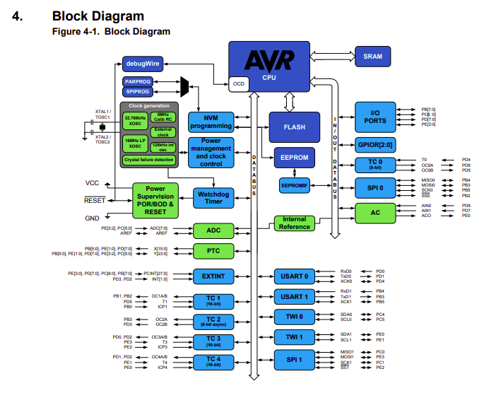
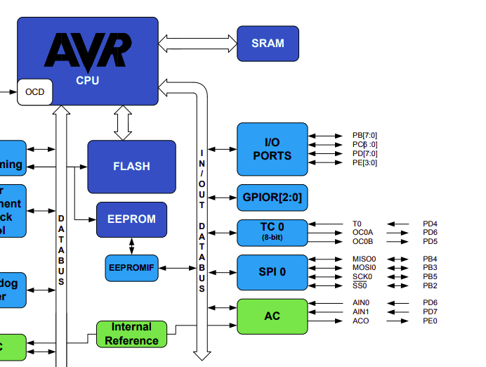
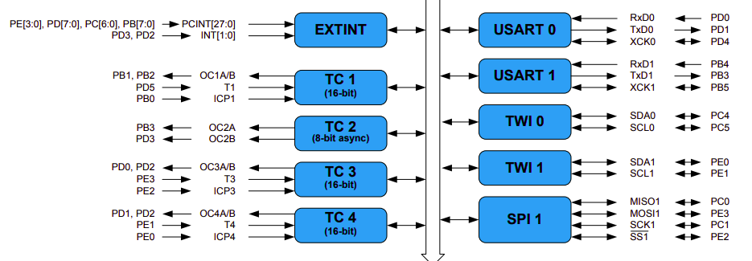
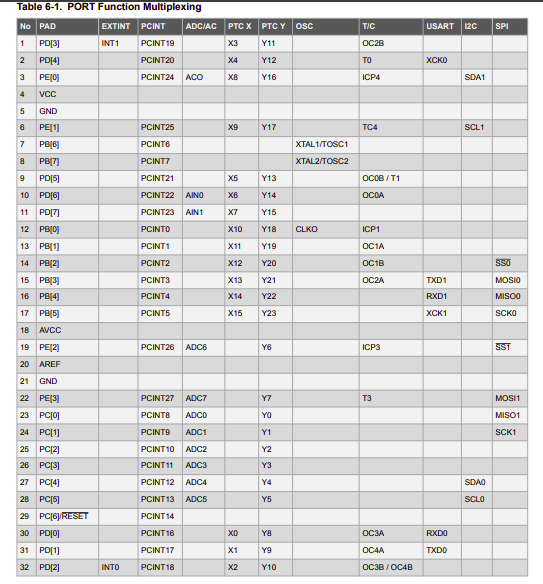
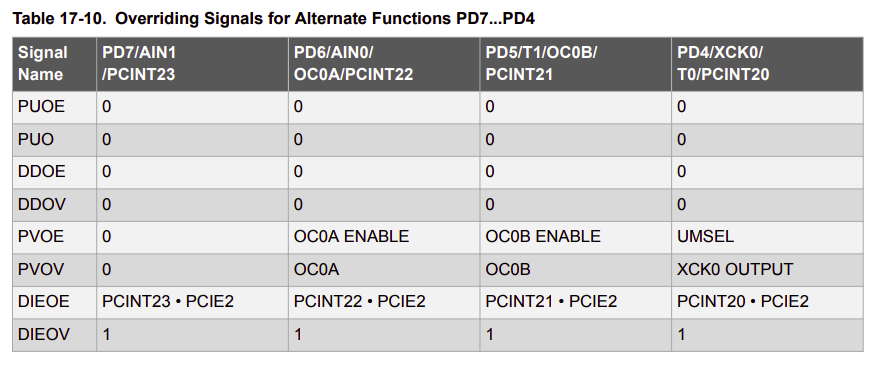
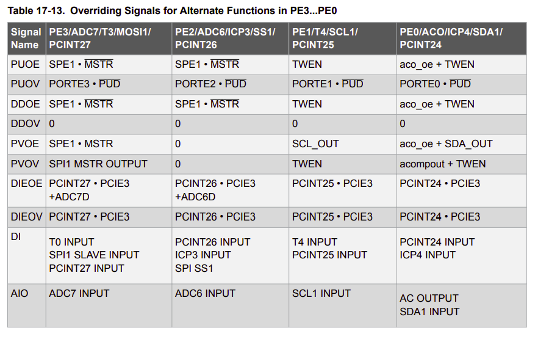
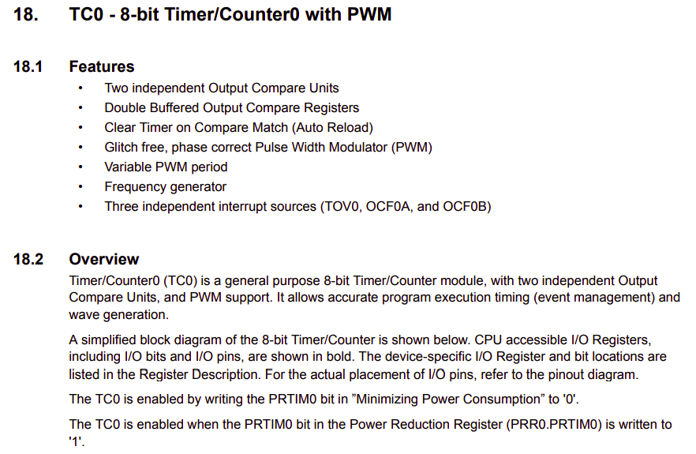
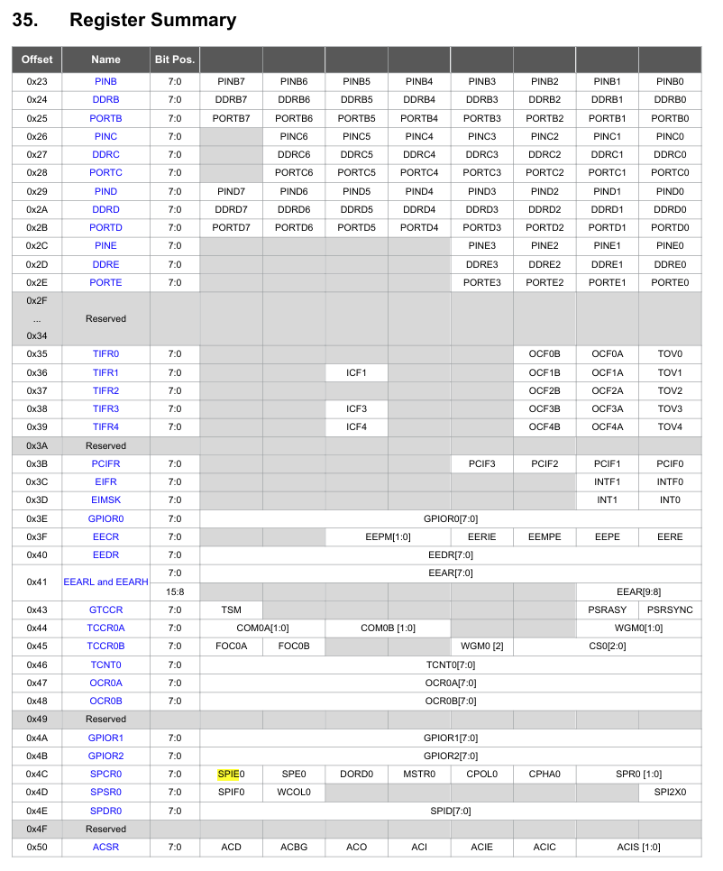

# Debrief of the pins

## VERY IMPORTANT!!!!!!! disconnect all jumpers from ATMega328pb before flashing code to it

## Aspirational assignments

### Motor

PD6: Right motor forward, PWM timer0 OC0A

PD3: Right motor reverse, PWM timer2 OC2B

PD5: Left motor forward, PWM timer0 OC0B

PB1: Left motor reverse, PWM timer1 OC1A

PC0 : Emergency stop

### Ultrasonic sensor

PD4: Trig pin
PE2: Echo pin, timer 3 ICP3 input capture

### SPI

Using SPI0

PB4: MISO - green
PB3: MOSI - yellow
PB5: SCK - blue
PB2: CS - purple

## Current assignments - broken and I believe actually not true

### Motor: (modified pins)

PD6: Right motor forward, PWM timer0
PD3: Right motor reverse, PWM timer2
PD5: Left motor forward, PWM timer0
PB1: Left motor reverse, PWM timer1

### Ultrasonic sensor

PD4: Trig pin
PB0: Echo pin, timer 3

### SPI

PB4: MISO
PB3: MOSI
PB5: SCK
PB2: CS

Motor pins were changed because PB2 is reserved for CS in SPI

## Original assignments

### Motor

PB2: Right forward, PWM timer1

PD6: Right reverse, PWM timer0

PB1: Left forward, PWM timer1

PD5:  Left reverse, PWM timer0

### Ultrasonic sensor

**PD4**: TRIG_PIN

**PB0**: ECHO_PIN, timer1

## What the datasheet says

### SPI

The ATMega has SPI0 and SPI1!

#### SPI0

PB4: MISO0

PB3: MOSI0

PB5: SCK0

PB2: SS0 (chip select)

#### SPI1

PC0: MISO1

PE3: MOSI1

PC1: SCK1

PE2: SS1 (chip select)

### Timers

#### Timer0

16-bit

PD4: T0

PD6: OC0A

PD5: OC0B

#### Timer1

16-bit

PD5: T1

PB1: OC1A

PB2: OC1B

PB0: ICP1

#### Timer2

8-bit async

PB3: OC2A

PD3: OC2B

#### Timer3

// TODO data sheet mentions external counter input for both tc3 and tc4. look into that

16-bit

PE3: T3

PD0: OC3A

PD2: OC3B

PE2: ICP3

#### Timer4

16-bit

PE1: T4

PD1: OC4A

PD2: OC4B // TODO: wdym timer3 and 4 share pins for OC_B ;-;. See table 17-10 for reference. can both timers be used at the same time without weird mode changing or multipllexing (if even possible)?

PE0: ICP4

### Screenshots for reference

#### Section 4

#### Section 17

#### Section 18

#### Section 35

